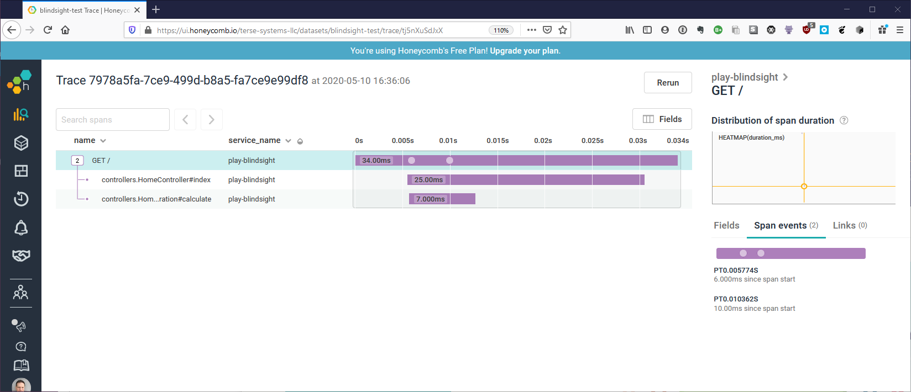

# Blindsight

[](https://travis-ci.org/tersesystems/blindsight)  [](https://scala-steward.org)

Blindsight is a Scala logging API that allows for structured logging through [DSL](https://tersesystems.github.io/blindsight/usage/dsl.html) and [Marker/Argument Type Classes](https://tersesystems.github.io/blindsight/usage/typeclass.html), [fluent logging](https://tersesystems.github.io/blindsight/usage/fluent.html), [semantic logging](https://tersesystems.github.io/blindsight/usage/semantic.html), [flow logging](https://tersesystems.github.io/blindsight/usage/flow.html), [context aware logging](https://tersesystems.github.io/blindsight/usage/context.html), [conditional logging](https://tersesystems.github.io/blindsight/usage/conditional.html), and [other useful things](https://tersesystems.github.io/blindsight/usage/overview.html).

## Dependencies

The only hard dependency is the SLF4J API, but the DSL functionality is only implemented for Logback with [logstash-logback-encoder](https://github.com/logstash/logstash-logback-encoder).  

Blindsight is a pure SLF4J wrapper: it delegates all logging through to the SLF4J API and does not configure or manage the SLF4J implementation at all.

Versions are published for Scala 2.11, 2.12, and 2.13.

## Install

See [Setup](https://tersesystems.github.io/blindsight/setup/index.html) for how to install Blindsight.

## Usage
 
To use a Blindsight Logger:

```scala
import com.tersesystems.blindsight._

val logger = LoggerFactory.getLogger
logger.info("I am an SLF4J-like logger")
```

[Structured DSL](https://tersesystems.github.io/blindsight/usage/dsl.html):

```scala
import com.tersesystems.blindsight._
import com.tersesystems.blindsight.DSL._

logger.info("Logs with argument {}", bobj("array" -> Seq("one", "two", "three")))
```

[Marker/Argument Type Classes](https://tersesystems.github.io/blindsight/usage/typeclass.html):
 
```scala
case class Lotto(
  id: Long,
  winningNumbers: List[Int],
  winners: List[Winner],
  drawDate: Option[java.util.Date]
) {
  lazy val asBObject: BObject = "lotto" ->
      ("lotto-id"          -> id) ~
        ("winning-numbers" -> winningNumbers) ~
        ("draw-date"       -> drawDate.map(_.toString)) ~
        ("winners"         -> winners.map(w => w.asBObject))
}

object Lotto {
  implicit val toArgument: ToArgument[Lotto] = ToArgument { lotto => Argument(lotto.asBObject) }
}

val winners =
  List(Winner(23, List(2, 45, 34, 23, 3, 5)), Winner(54, List(52, 3, 12, 11, 18, 22)))
val lotto = Lotto(5, List(2, 45, 34, 23, 7, 5, 3), winners, None)

logger.info("message {}", lotto) // auto-converted to structured output
```

[Fluent logging](https://tersesystems.github.io/blindsight/usage/fluent.html):

```scala
logger.fluent.info.message("The Magic Words are").argument(Arguments("Squeamish", "Ossifrage")).logWithPlaceholders()
```

[Semantic logging](https://tersesystems.github.io/blindsight/usage/semantic.html):

```scala
// log only user events
logger.semantic[UserEvent].info(userEvent)

// Works well with refinement types
import eu.timepit.refined.api.Refined
import eu.timepit.refined.string._
import eu.timepit.refined._
logger.semantic[String Refined Url].info(refineMV(Url)("https://tersesystems.com"))
```

[Flow logging](https://tersesystems.github.io/blindsight/usage/flow.html):

```scala
import com.tersesystems.blindsight.flow._

implicit def flowBehavior[B]: FlowBehavior[B] = ???

val result = logger.flow.trace(arg1 + arg2)
```

[Conditional logging](https://tersesystems.github.io/blindsight/usage/conditional.html):

```scala
logger.onCondition(booleanCondition).info("Only logs when condition is true")

logger.info.when(booleanCondition) { info => info("when true") }
```

And [context aware logging](https://tersesystems.github.io/blindsight/usage/context.html):

```scala
import com.tersesystems.blindsight.flow._

logger.withMarker(bobj("userId" -> userId)).info("Logging with user id added as a context marker!")
val contextMarkers: Markers = logger.markers
```

## Example

There's an example application at [https://github.com/tersesystems/play-blindsight](https://github.com/tersesystems/play-blindsight) that integrates with Honeycomb Tracing using the flow logger:



## Documentation 

See [the documentation](https://tersesystems.github.io/blindsight/) for more details.

## Naming

The name is taken from Peter Watts's excellent first contact novel, [Blindsight](https://en.wikipedia.org/wiki/Blindsight_\(Watts_novel\)).

## License

Blindsight is released under the "Apache 2" license. See [LICENSE](LICENSE) for specifics and copyright declaration.