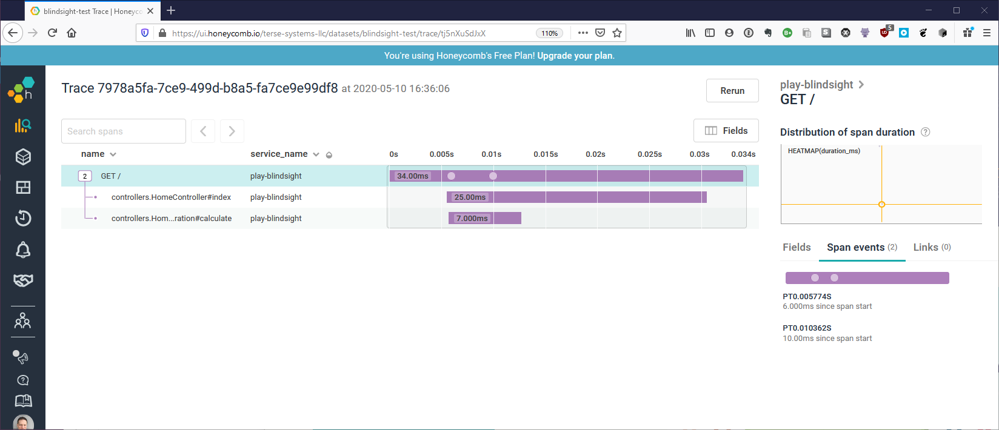

# Flow API

The flow API is used when logging surrounds an execution flow.  This is a good fit when you want tracing or [domain-oriented observability](https://martinfowler.com/articles/domain-oriented-observability.html).
 
You can access the flow logger from Blindsight using `logger.flow`:

```scala
import com.tersesystems.blindsight._
import com.tersesystems.blindsight.flow._

val logger = LoggerFactory.getLogger
val flowLogger: FlowLogger = logger.flow
```

## Usage

The flow logger takes a block of execution, and returns the result transparently, according to the log level.  

@@snip [Flow.scala](../../../test/scala/example/flow/SimpleFlow.scala) { #flow_method }

The result should have a type class instance of @scaladoc[ToArguments](com.tersesystems.blindsight.api.ToArguments), so that it can be considered in logging.  For example, if the return type is `Person`, then you must have a `ToArguments[Person]` in scope:

@@snip [Flow.scala](../../../test/scala/example/flow/SimpleFlow.scala) { #flow_person_definition }

If logging is enabled, then the execution is wrapped to capture the result or execution, and then the result is returned or execution rethrown.  If the logging is not enabled (whether through conditional logging, explicit filtering, or threshold), then execution of the block still proceeds but is not wrapped by a `Try` block.

## Flow Behavior

What happens in a flow is determined by the @scaladoc[FlowBehavior](com.tersesystems.blindsight.flow.FlowBehavior).  Implementing a flow behavior comes down to creating @scaladoc[Markers](com.tersesystems.blindsight.api.Markers) and @scaladoc[Statement](com.tersesystems.blindsight.api.Statement) for entry, exit, and exceptions.

There are two out of the box behaviors provided: @scaladoc[SimpleFlowBehavior](com.tersesystems.blindsight.flow.SimpleFlowBehavior) and @scaladoc[XLoggerFlowBehavior](com.tersesystems.blindsight.flow.XLoggerFlowBehavior).  These are modelled after [pos](https://github.com/JohnReedLOL/pos) and [XLogger](http://www.slf4j.org/extensions.html#extended_logger), respectively.

## Integration

Flow based logging, because it leaves the flow behavior open, is a good way to integrate with third party systems.

### Opentracing

While it's possible to set up an Opentracing  @scaladoc[FlowBehavior](com.tersesystems.blindsight.flow.FlowBehavior) that creates spans directly, spans will not show up in the logs (which is confusing) and will tightly couple the Opentracing instrumentation with your logging (which may lead to bugs).
  
What you can do instead is inject your logs into an active span inside of a flow, using the [standard log fields](https://github.com/opentracing/specification/blob/master/semantic_conventions.md#log-fields-table):

```java
ActiveSpan span = ...
span.log(ImmutableMap.of("message", message));
span.log(ImmutableMap.of("error.kind", throwable.getClass().getName()));
span.log(ImmutableMap.of("error.object", throwable));
```

### Datadog

You can connect your logs to Datadog traces using the [Correlation Identifier](https://docs.datadoghq.com/tracing/connect_logs_and_traces/java/?tab=slf4jlogback#manual-trace-id-injection) using `dd.trace_id` and `dd.span_id` respectively:

```scala
import datadog.trace.api.CorrelationIdentifier._

val datadogTraceId = Markers("dd.trace_id" -> Option(getTraceId).getOrElse("0"))
val datadogSpanId = Markers("dd.span_id" -> Option(getSpanId).getOrElse("0"))
```

### Honeycomb

If you integrate with [logback-tracing](https://tersesystems.github.io/terse-logback/guide/tracing/), then you can also log to Honeycomb using a @scaladoc[FlowBehavior](com.tersesystems.blindsight.flow.FlowBehavior).  To do this, add the following resolver:

```
resolvers += Resolver.bintrayRepo("tersesystems", "maven")
```

and the following dependencies:

@@dependency[sbt,Maven,Gradle] {
  group="com.tersesystems.logback"
  artifact="logback-tracing"
  version="latest.version"
}

@@dependency[sbt,Maven,Gradle] {
  group="com.tersesystems.logback"
  artifact="logback-uniqueid-appender"
  version="latest.version"
}

See [play-blindsight](http://github.com/wsargent/play-blindsight) for a worked example.



You can produce Honeycomb manual traces with the following:

@@snip [HoneycombFlow.scala](../../../test/scala/example/flow/HoneycombFlow.scala) { #honeycomb_flow_example }
